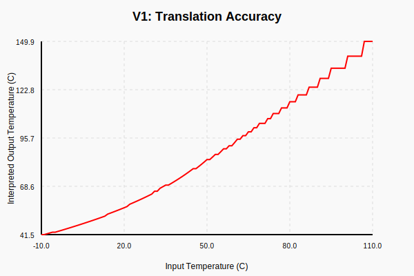
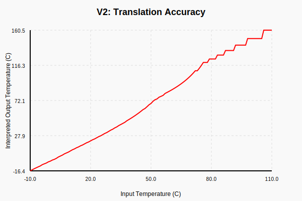
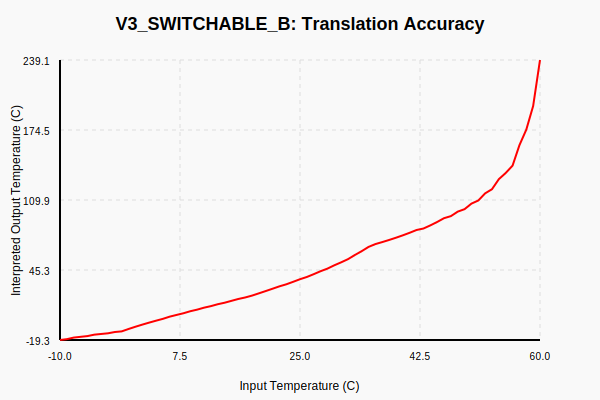
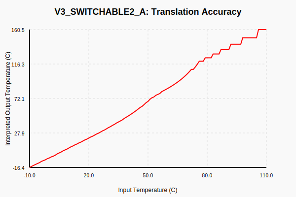
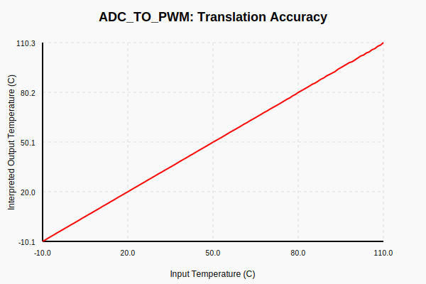
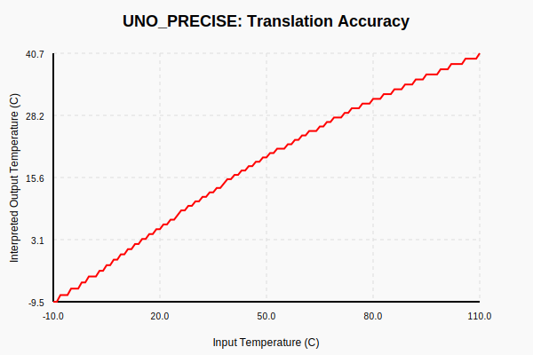
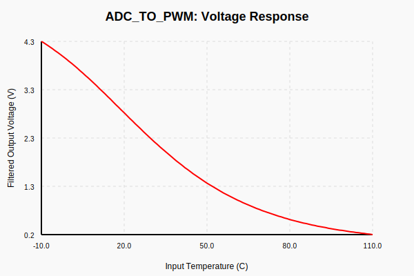
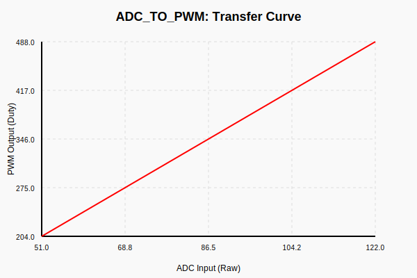

# Thermistor Signal Translator

This project provides various Arduino-based solutions for translating analog signals from one thermistor profile to another using lookup tables. This is especially useful for replacing obsolete or unavailable thermistors in older machinery or vehicles.

## Features

- **Profile Translation**: Maps any input resistance curve to any output voltage curve.
- **Lookup Tables with Interpolation**: Uses `PROGMEM` to store translation points with linear interpolation for high accuracy.
- **Signal Conditioning**: Includes versions with IIR and Kalman filtering for noise reduction.
- **Non-blocking Architecture**: All modern versions use asynchronous logic for high responsiveness.
- **Safety Failsafes**: Detects sensor disconnection or short-circuits to prevent system damage.
- **High-Resolution PWM**: Support for 12-bit PWM on AVR targets.

## Available Versions

### 1. Simple Translator (`translator.ino`)
- **Description**: The most basic version, now improved with IIR filtering and robust interpolation.
- **Best For**: Systems where simplicity is key and noise is moderate.
- **Accuracy**: 

### 2. Precise Translator (`translator_v2.ino`)
- **Description**: Uses explicitly defined ADC/PWM breakpoints for non-linear mappings.
- **Best For**: Highly non-linear thermistor curves.
- **Accuracy**: 

### 3. Switchable Curve (`translator_v3_switchable.ino`)
- **Description**: Allows switching between two different translation curves using a physical pin.
- **Best For**: Applications with multi-mode operation or selectable sensor types.
- **Accuracy (Curve A)**: 
- **Accuracy (Curve B)**: 

### 4. Precise Switchable (`translator_v3_switchable2.ino`)
- **Description**: Combines switchable curves with advanced interpolation structures.
- **Accuracy (Curve A)**: 

### 5. High-Resolution Kalman (`adc_to_pwm.ino`)
- **Description**: Industrial-grade implementation with 12-bit PWM and scalar Kalman filtering.
- **Best For**: High-precision measurement and control systems.
- **Accuracy**: 

### 6. Uno Precise (`translator_uno_precise.ino`)
- **Description**: Specifically optimized for ATmega328P with manual Timer1 configuration for 12-bit resolution.
- **Accuracy**: 

## System Simulation

Every version is verified using a full hardware-in-the-loop (HIL) simulation chain:
`Input Temp -> Source NTC -> Voltage Divider -> ADC -> Arduino -> PWM -> RC Filter -> Voltage -> Target NTC Interpretation -> Output Temp`

### Simulation Results (Example: High-Precision Version)
- **Voltage Response**: 
- **Internal Transfer Curve**: 

## Testing

Run the full automated test suite:
```bash
python3 tests/run_tests.py
```
This script compiles all sketches, runs simulations, evaluates noise robustness, and generates the SVG graphs shown above.

## Developer Tools

### Table Generator (`tools/gen_table.py`)
Generate a `PROGMEM` lookup table by defining your source and target sensor parameters:
```bash
python3 tools/gen_table.py --sr0 10000 --sb 3950 --tr0 10000 --tb 3435 --points 16
```
It supports end-to-end translation, ripple prediction, and resolution scaling.
