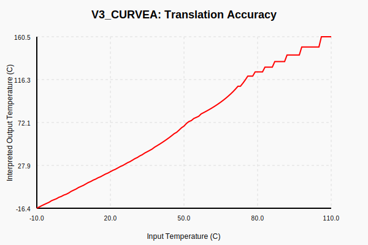
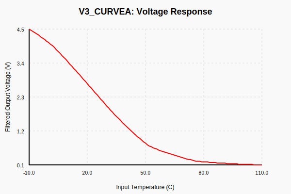
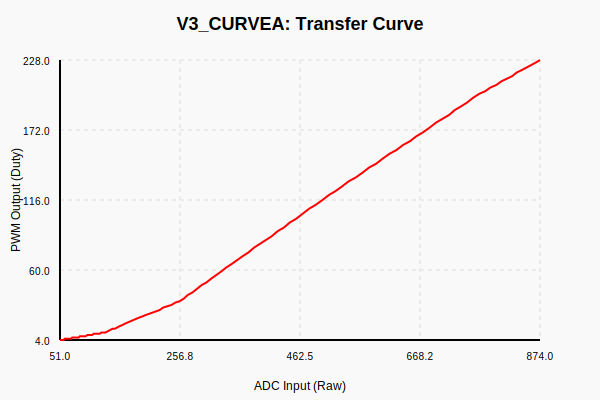

# thermistor_translator
translates any analog input profile into any analog output profile using a lookup table

Written by BingAI.

It is designed to allow f.e. replacing one thermistor model with another thermistor model,
a common problem when repairing old machines and cars whose original parts are 
no longer available. 

## Testing

This project includes a comprehensive testing suite using a mock Arduino environment and a physics/circuit simulator.

To run the tests:
```bash
python3 tests/run_tests.py
```

The tests verify the translation logic of all `.ino` files using a simulated NTC thermistor and voltage divider circuit. It also includes noise robustness tests to evaluate the performance of Kalman and IIR filters.

### System Simulation

The testing suite simulates the entire hardware chain:
`Input Temp -> Source NTC -> Voltage Divider -> ADC -> Arduino -> PWM -> RC Filter -> Voltage -> Target NTC Interpretation -> Output Temp`

#### Results for `translator_v3_switchable2.ino` (Curve A)

- **Translation Accuracy (Input vs Output Temp)**:

- **Voltage Response**:

- **Firmware Transfer Curve (ADC vs PWM)**:


#### Results for `adc_to_pwm.ino` (High-Precision 12-bit)

- **Translation Accuracy**:

- **Firmware Transfer Curve**:


## Tools

### Table Generator

A tool to generate `PROGMEM` lookup tables based on thermistor parameters:
```bash
python3 tools/gen_table.py --r0 10000 --b 3950 --rp 10000 --points 10
```
